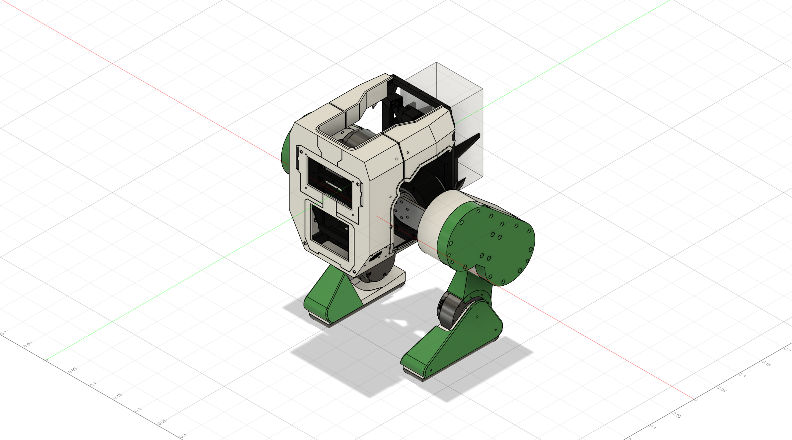

# Floyd-BDX-Biped

Isaac Lab reinforcement learning training configuration for Floyd, a custom BDX-style bipedal robot.

## Robot
- 8 DOF biped (no hip yaw): Hip Roll, Hip Pitch, Knee Pitch, Ankle Pitch per leg
- RS03 actuators on Hip Roll, Hip Pitch, Knee Pitch
- RS02 actuators on Ankle Pitch
- ~10.5kg total weight

## Acknowledgements

- **[Kayden Knapik / BDX-R](https://github.com/BDX-R/BDX-R-IsaacLab)** — Training architecture and environment setup heavily based on his open-source BDX-R project.
- **[NVIDIA Isaac Lab](https://github.com/isaac-sim/IsaacLab)** — Simulation and RL training framework.
