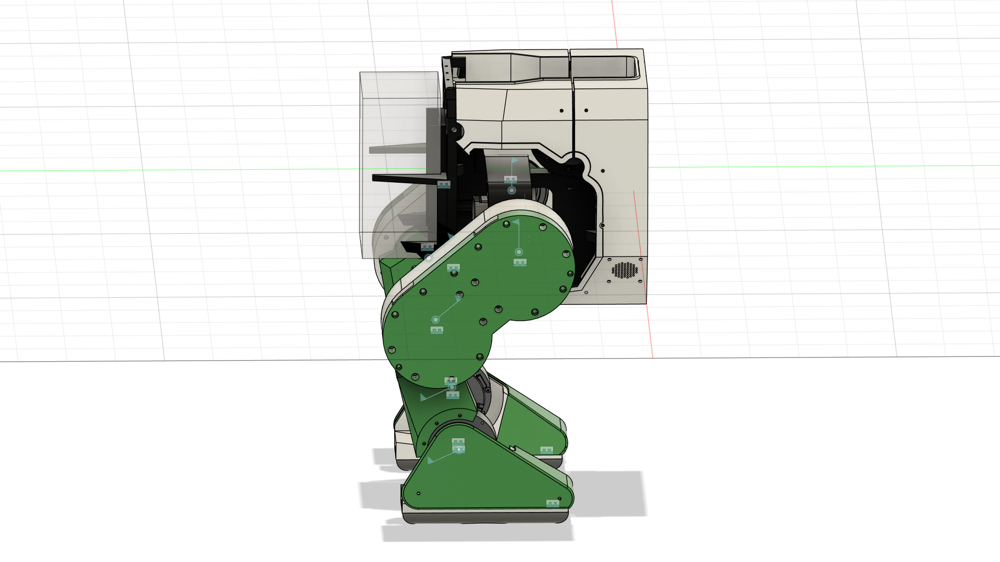

# Floyd_URDF — Robot Description



## Overview

| Property | Value |
|----------|-------|
| Total mass | 15.715 kg |
| Links | 11 |
| Joints | 10 (8 movable) |
| Assemblies | 1 |
| Root link | `base_link` |

## Table of Contents

- [Kinematic Tree](#kinematic-tree)
- [Link Properties](#link-properties)
- [Joint Properties](#joint-properties)
- [Assembly Breakdown](#assembly-breakdown)
- [Quick Start (ROS 2)](#quick-start-ros-2)
- [Files](#files)

## Kinematic Tree

```
base_link
  └─ LeftHipRoll [continuous]
    HipRollMountLeft [BAKE]
      └─ LeftHipPitch [continuous]
        RS03_LeftHipPitch [BAKE]
          └─ LeftKneePitch [continuous]
            RS02_LeftAnklePitch [BAKE]
              └─ LeftAnklePitch [continuous]
                FootPadLeft [BAKE]
  └─ RightHipRoll [continuous]
    HipRollMountRight [BAKE]
      └─ RightHipPitch [continuous]
        RS03_RightKneePitch [BAKE]
          └─ RightKneePitch [continuous]
            RS02_RightAnklePitch [BAKE]
              └─ RightAnklePitch [continuous]
                FootBaseRight [BAKE]
                  └─ Rigid_45 [fixed]
                    FootCoverRight
                  └─ Rigid_46 [fixed]
                    FootPadRight
```

## Link Properties

| Link | Mass (kg) | Material | Collision | Bodies |
|------|-----------|----------|-----------|--------|
| `FootBaseRight` | 0.1293 | PET_Plastic | box | 1 |
| `FootCoverRight` | 0.0258 | PET_Plastic | box | 1 |
| `FootPadLeft` | 0.9524 | Steel | box | 1 |
| `FootPadRight` | 0.7975 | Steel | box | 1 |
| `HipRollMountLeft` | 0.0991 | Aluminum | box | 1 |
| `HipRollMountRight` | 0.0991 | Aluminum | box | 1 |
| `RS02_LeftAnklePitch` | 1.6362 | Steel | box | 1 |
| `RS02_RightAnklePitch` | 1.6362 | Steel | box | 1 |
| `RS03_LeftHipPitch` | 2.3105 | Steel | box | 1 |
| `RS03_RightKneePitch` | 2.3105 | Steel | box | 1 |
| `base_link` | 5.7185 | Steel | cylinder | 1 |

## Joint Properties

| Joint | Type | Parent → Child | Axis | Limits |
|-------|------|---------------|------|--------|
| `LeftAnklePitch` | continuous | `RS02_LeftAnklePitch` → `FootPadLeft` | (1,-0,-0) | — |
| `LeftHipPitch` | continuous | `HipRollMountLeft` → `RS03_LeftHipPitch` | (-0,0,-1) | — |
| `LeftHipRoll` | continuous | `base_link` → `HipRollMountLeft` | (-0,0,-1) | — |
| `LeftKneePitch` | continuous | `RS03_LeftHipPitch` → `RS02_LeftAnklePitch` | (0,0,-1) | — |
| `RightAnklePitch` | continuous | `RS02_RightAnklePitch` → `FootBaseRight` | (-1,0,0) | — |
| `RightHipPitch` | continuous | `HipRollMountRight` → `RS03_RightKneePitch` | (-0,-0,1) | — |
| `RightHipRoll` | continuous | `base_link` → `HipRollMountRight` | (-0,-0,1) | — |
| `RightKneePitch` | continuous | `RS03_RightKneePitch` → `RS02_RightAnklePitch` | (0,-0,-1) | — |
| `Rigid_45` | fixed | `FootBaseRight` → `FootCoverRight` | (0,0,1) | — |
| `Rigid_46` | fixed | `FootBaseRight` → `FootPadRight` | (0,0,1) | — |

## Assembly Breakdown

### Floyd_URDF

- **Links**: HipRollMountLeft, HipRollMountRight, RS03_LeftHipPitch, RS02_LeftAnklePitch, FootPadLeft, RS02_RightAnklePitch, FootCoverRight, FootBaseRight, FootPadRight, RS03_RightKneePitch, base_link
- **Total mass**: 15.715 kg

## Quick Start (ROS 2)

```bash
# 1. Copy package to your ROS 2 workspace
cp -r Floyd_URDF_description ~/ros2_ws/src/

# 2. Build
cd ~/ros2_ws
colcon build --packages-select Floyd_URDF_description
source install/setup.bash

# 3. Visualize in RViz2
ros2 launch Floyd_URDF_description display.launch.py

# 4. Validate URDF structure
check_urdf install/Floyd_URDF_description/share/Floyd_URDF_description/urdf/Floyd_URDF.urdf

# 5. Print kinematic tree
urdf_to_graphviz install/Floyd_URDF_description/share/Floyd_URDF_description/urdf/Floyd_URDF.urdf
```

**Joint control**: The launch file includes `joint_state_publisher_gui` —
use the sliders to move revolute/prismatic joints in RViz2.

**Topic inspection**:
```bash
# See published joint states
ros2 topic echo /joint_states

# See robot description parameter
ros2 param get /robot_state_publisher robot_description
```

## Files

| Path | Description |
|------|-------------|
| `urdf/Floyd_URDF.urdf.xacro` | Top-level xacro (entry point) |
| `urdf/Floyd_URDF.urdf` | Flat URDF (for validation) |
| `urdf/assemblies/` | Per-assembly xacro macros |
| `meshes/` | Visual (OBJ) and collision (STL) meshes |
| `launch/display.launch.py` | Launch robot_state_publisher, RViz, and generated controllers |
| `config/joint_state.yaml` | Joint state publisher config |
| `config/ros2_controllers.yaml` | Generated ros2_control controller manager config |
| `robot_data.yaml` | Supplementary data (beyond URDF) |
| `docs/transforms.md` | Transformation matrices (KaTeX) |

## Customizing

Assemblies tagged `!dummy_` are designed to be swapped out. To replace one:

1. Create your replacement as a xacro macro with the same interface
2. Place it in `urdf/assemblies/`
3. Update the `<xacro:include>` in `urdf/Floyd_URDF.urdf.xacro`
4. Update meshes in `meshes/<your_assembly>/`

The xacro prefix system (`${prefix}`) ensures link names stay unique
when multiple instances of the same assembly are used.

---
*Generated by Fusion URDF/XACRO Exporter v3.0.0*