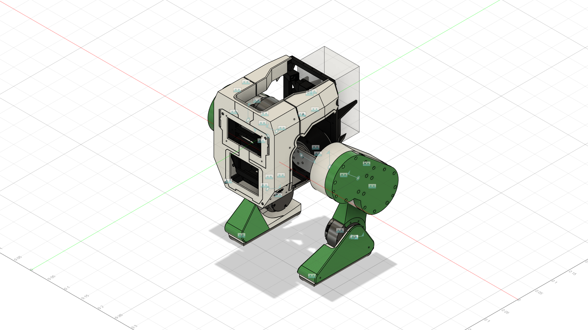

# Floyd_URDF — Robot Description



## Overview

| Property | Value |
|----------|-------|
| Total mass | 15.715 kg |
| Links | 35 |
| Joints | 34 (8 movable) |
| Assemblies | 1 |
| Root link | `base_link` |

## Table of Contents

- [Kinematic Tree](#kinematic-tree)
- [Link Properties](#link-properties)
- [Joint Properties](#joint-properties)
- [Assembly Breakdown](#assembly-breakdown)
- [Quick Start (ROS 2)](#quick-start-ros-2)
- [Files](#files)

## Kinematic Tree

```
base_link
  └─ Rigid_47 [fixed]
    RS02
  └─ Rigid_48 [fixed]
    BellyBase
      └─ Rigid_58 [fixed]
        FrontPanel
      └─ Rigid_63 [fixed]
        LowerPanel
  └─ Rigid_49 [fixed]
    FrontBase
      └─ Rigid_66 [fixed]
        TopBase
          └─ Rigid_56 [fixed]
            TopRightPanel
          └─ Rigid_57 [fixed]
            TopLeftPanel
  └─ Rigid_50 [fixed]
    Back_Base
      └─ Rigid_51 [fixed]
        Tail_Base
      └─ Rigid_52 [fixed]
        Battery_Mount
          └─ Rigid_53 [fixed]
            Battery
  └─ Rigid_54 [fixed]
    RS03_LeftHipRoll
      └─ LeftHipRoll [continuous]
        HipRollMountLeft [BAKE]
          └─ LeftHipPitch [continuous]
            RS03_LeftHipPitch [BAKE]
              └─ Rigid_59 [fixed]
                ThighMountFemaleLeft
                  └─ Rigid_17 [fixed]
                    ThighMountMaleLeft
                  └─ Rigid_64 [fixed]
                    RS03_LeftKneePitch
                      └─ LeftKneePitch [continuous]
                        LowerLegLeft [BAKE]
                          └─ Rigid_23 [fixed]
                            RS02_LeftAnklePitch
                              └─ LeftAnklePitch [continuous]
                                FootBaseLeft [BAKE]
                                  └─ Rigid_21 [fixed]
                                    FootCoverLeft
                                  └─ Rigid_25 [fixed]
                                    FootPadLeft
  └─ Rigid_55 [fixed]
    RS03_RightHipRoll
      └─ RightHipRoll [continuous]
        HipRollMountRight [BAKE]
          └─ RightHipPitch [continuous]
            RS03_RightHipPitch [BAKE]
              └─ Rigid_61 [fixed]
                ThighMountFemaleRight
                  └─ Rigid_29 [fixed]
                    ThighMountMaleRight
                  └─ Rigid_65 [fixed]
                    RS03_RightKneePitch
                      └─ RightKneePitch [continuous]
                        LowerLegRight [BAKE]
                          └─ Rigid_28 [fixed]
                            RS02_RightAnklePitch
                              └─ RightAnklePitch [continuous]
                                FootBaseRight [BAKE]
                                  └─ Rigid_45 [fixed]
                                    FootCoverRight
                                  └─ Rigid_46 [fixed]
                                    FootPadRight
```

## Link Properties

| Link | Mass (kg) | Material | Collision | Bodies |
|------|-----------|----------|-----------|--------|
| `Back_Base` | 0.1012 | PET_Plastic | box | 1 |
| `Battery` | 1.2715 | ABS_Plastic | box | 1 |
| `Battery_Mount` | 0.0467 | PET_Plastic | box | 1 |
| `BellyBase` | 0.0983 | PET_Plastic | box | 1 |
| `FootBaseLeft` | 0.1293 | PET_Plastic | box | 1 |
| `FootBaseRight` | 0.1293 | PET_Plastic | box | 1 |
| `FootCoverLeft` | 0.0258 | PET_Plastic | box | 1 |
| `FootCoverRight` | 0.0258 | PET_Plastic | box | 1 |
| `FootPadLeft` | 0.7973 | Steel | box | 1 |
| `FootPadRight` | 0.7975 | Steel | box | 1 |
| `FrontBase` | 0.1381 | PET_Plastic | box | 1 |
| `FrontPanel` | 0.1245 | PET_Plastic | box | 1 |
| `HipRollMountLeft` | 0.0991 | Aluminum | box | 1 |
| `HipRollMountRight` | 0.0991 | Aluminum | box | 1 |
| `LowerLegLeft` | 0.2039 | PET_Plastic | box | 1 |
| `LowerLegRight` | 0.2039 | PET_Plastic | box | 1 |
| `LowerPanel` | 0.0178 | PET_Plastic | box | 1 |
| `RS02` | 1.4323 | Steel | box | 1 |
| `RS02_LeftAnklePitch` | 1.4323 | Steel | box | 1 |
| `RS02_RightAnklePitch` | 1.4323 | Steel | box | 1 |
| `RS03_LeftHipPitch` | 0.9389 | Steel | box | 1 |
| `RS03_LeftHipRoll` | 0.9390 | Steel | box | 1 |
| `RS03_LeftKneePitch` | 0.9389 | Steel | box | 1 |
| `RS03_RightHipPitch` | 0.9389 | Steel | box | 1 |
| `RS03_RightHipRoll` | 0.9390 | Steel | box | 1 |
| `RS03_RightKneePitch` | 0.9389 | Steel | box | 1 |
| `Tail_Base` | 0.0948 | PET_Plastic | box | 1 |
| `ThighMountFemaleLeft` | 0.2357 | PET_Plastic | box | 1 |
| `ThighMountFemaleRight` | 0.2357 | PET_Plastic | box | 1 |
| `ThighMountMaleLeft` | 0.1969 | PET_Plastic | box | 1 |
| `ThighMountMaleRight` | 0.1969 | PET_Plastic | box | 1 |
| `TopBase` | 0.0861 | PET_Plastic | box | 1 |
| `TopLeftPanel` | 0.0176 | PET_Plastic | box | 1 |
| `TopRightPanel` | 0.0176 | PET_Plastic | box | 1 |
| `base_link` | 0.3942 | PET_Plastic | cylinder | 1 |

## Joint Properties

| Joint | Type | Parent → Child | Axis | Limits |
|-------|------|---------------|------|--------|
| `LeftAnklePitch` | continuous | `RS02_LeftAnklePitch` → `FootBaseLeft` | (1,0,-0) | — |
| `LeftHipPitch` | continuous | `HipRollMountLeft` → `RS03_LeftHipPitch` | (-0,0,-1) | — |
| `LeftHipRoll` | continuous | `RS03_LeftHipRoll` → `HipRollMountLeft` | (-0,0,-1) | — |
| `LeftKneePitch` | continuous | `RS03_LeftKneePitch` → `LowerLegLeft` | (-1,0,0) | — |
| `RightAnklePitch` | continuous | `RS02_RightAnklePitch` → `FootBaseRight` | (-1,-0,-0) | — |
| `RightHipPitch` | continuous | `HipRollMountRight` → `RS03_RightHipPitch` | (0,0,-1) | — |
| `RightHipRoll` | continuous | `RS03_RightHipRoll` → `HipRollMountRight` | (-0,-0,1) | — |
| `RightKneePitch` | continuous | `RS03_RightKneePitch` → `LowerLegRight` | (1,-0,0) | — |
| `Rigid_17` | fixed | `ThighMountFemaleLeft` → `ThighMountMaleLeft` | (0,0,1) | — |
| `Rigid_21` | fixed | `FootBaseLeft` → `FootCoverLeft` | (0,0,1) | — |
| `Rigid_23` | fixed | `LowerLegLeft` → `RS02_LeftAnklePitch` | (0,0,1) | — |
| `Rigid_25` | fixed | `FootBaseLeft` → `FootPadLeft` | (0,0,1) | — |
| `Rigid_28` | fixed | `LowerLegRight` → `RS02_RightAnklePitch` | (0,0,1) | — |
| `Rigid_29` | fixed | `ThighMountFemaleRight` → `ThighMountMaleRight` | (0,0,1) | — |
| `Rigid_45` | fixed | `FootBaseRight` → `FootCoverRight` | (0,0,1) | — |
| `Rigid_46` | fixed | `FootBaseRight` → `FootPadRight` | (0,0,1) | — |
| `Rigid_47` | fixed | `base_link` → `RS02` | (0,0,1) | — |
| `Rigid_48` | fixed | `base_link` → `BellyBase` | (0,0,1) | — |
| `Rigid_49` | fixed | `base_link` → `FrontBase` | (0,0,1) | — |
| `Rigid_50` | fixed | `base_link` → `Back_Base` | (0,0,1) | — |
| `Rigid_51` | fixed | `Back_Base` → `Tail_Base` | (0,0,1) | — |
| `Rigid_52` | fixed | `Back_Base` → `Battery_Mount` | (0,0,1) | — |
| `Rigid_53` | fixed | `Battery_Mount` → `Battery` | (0,0,1) | — |
| `Rigid_54` | fixed | `base_link` → `RS03_LeftHipRoll` | (0,0,1) | — |
| `Rigid_55` | fixed | `base_link` → `RS03_RightHipRoll` | (0,0,1) | — |
| `Rigid_56` | fixed | `TopBase` → `TopRightPanel` | (0,0,1) | — |
| `Rigid_57` | fixed | `TopBase` → `TopLeftPanel` | (0,0,1) | — |
| `Rigid_58` | fixed | `BellyBase` → `FrontPanel` | (0,0,1) | — |
| `Rigid_59` | fixed | `RS03_LeftHipPitch` → `ThighMountFemaleLeft` | (0,0,1) | — |
| `Rigid_61` | fixed | `RS03_RightHipPitch` → `ThighMountFemaleRight` | (0,0,1) | — |
| `Rigid_63` | fixed | `BellyBase` → `LowerPanel` | (0,0,1) | — |
| `Rigid_64` | fixed | `ThighMountFemaleLeft` → `RS03_LeftKneePitch` | (0,0,1) | — |
| `Rigid_65` | fixed | `ThighMountFemaleRight` → `RS03_RightKneePitch` | (0,0,1) | — |
| `Rigid_66` | fixed | `FrontBase` → `TopBase` | (0,0,1) | — |

## Assembly Breakdown

### Floyd_URDF

- **Links**: base_link, BellyBase, Back_Base, FrontBase, TopBase, Tail_Base, Battery_Mount, TopLeftPanel, TopRightPanel, FrontPanel, RS03_LeftHipRoll, RS03_RightHipRoll, Battery, LowerPanel, HipRollMountLeft, HipRollMountRight, RS03_LeftHipPitch, RS03_RightHipPitch, RS03_LeftKneePitch, ThighMountFemaleLeft, ThighMountMaleLeft, LowerLegLeft, RS02_LeftAnklePitch, FootBaseLeft, FootCoverLeft, FootPadLeft, ThighMountMaleRight, ThighMountFemaleRight, LowerLegRight, RS02_RightAnklePitch, FootCoverRight, FootBaseRight, FootPadRight, RS03_RightKneePitch, RS02
- **Total mass**: 15.715 kg

## Quick Start (ROS 2)

```bash
# 1. Copy package to your ROS 2 workspace
cp -r Floyd_URDF_description ~/ros2_ws/src/

# 2. Build
cd ~/ros2_ws
colcon build --packages-select Floyd_URDF_description
source install/setup.bash

# 3. Visualize in RViz2
ros2 launch Floyd_URDF_description display.launch.py

# 4. Validate URDF structure
check_urdf install/Floyd_URDF_description/share/Floyd_URDF_description/urdf/Floyd_URDF.urdf

# 5. Print kinematic tree
urdf_to_graphviz install/Floyd_URDF_description/share/Floyd_URDF_description/urdf/Floyd_URDF.urdf
```

**Joint control**: The launch file includes `joint_state_publisher_gui` —
use the sliders to move revolute/prismatic joints in RViz2.

**Topic inspection**:
```bash
# See published joint states
ros2 topic echo /joint_states

# See robot description parameter
ros2 param get /robot_state_publisher robot_description
```

## Files

| Path | Description |
|------|-------------|
| `urdf/Floyd_URDF.urdf.xacro` | Top-level xacro (entry point) |
| `urdf/Floyd_URDF.urdf` | Flat URDF (for validation) |
| `urdf/assemblies/` | Per-assembly xacro macros |
| `meshes/` | Visual (OBJ) and collision (STL) meshes |
| `launch/display.launch.py` | Launch robot_state_publisher, RViz, and generated controllers |
| `config/joint_state.yaml` | Joint state publisher config |
| `config/ros2_controllers.yaml` | Generated ros2_control controller manager config |
| `robot_data.yaml` | Supplementary data (beyond URDF) |
| `docs/transforms.md` | Transformation matrices (KaTeX) |

## Customizing

Assemblies tagged `!dummy_` are designed to be swapped out. To replace one:

1. Create your replacement as a xacro macro with the same interface
2. Place it in `urdf/assemblies/`
3. Update the `<xacro:include>` in `urdf/Floyd_URDF.urdf.xacro`
4. Update meshes in `meshes/<your_assembly>/`

The xacro prefix system (`${prefix}`) ensures link names stay unique
when multiple instances of the same assembly are used.

---
*Generated by Fusion URDF/XACRO Exporter v3.0.0*